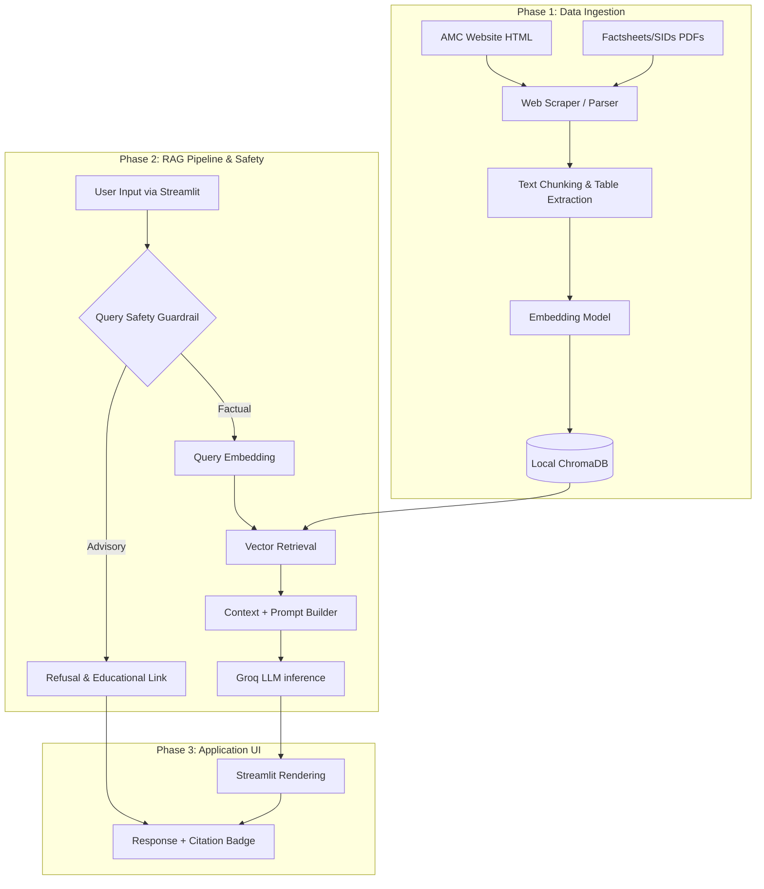

# RAG-Based Mutual Fund FAQ Chatbot Architecture (Streamlit MVP)

This document provides a comprehensive, technically detailed breakdown of the simplified, deployment-ready architecture for the Mutual Fund FAQ Chatbot using Groq and Streamlit.

## 1. System Architecture Overview

## 2. Phase 1 Data Sources (ICICI Prudential via Groww)

**AMC:** ICICI Prudential Mutual Fund  
**Source Platform:** [Groww.in](https://groww.in)

### 2.1 Fund House Overview
| # | URL |
|---|-----|
| 1 | https://groww.in/mutual-funds/filter?fund_house=%5B%22ICICI+Prudential+Mutual+Fund%22%5D |

### 2.2 Individual Scheme Pages (20 Schemes)
| # | Scheme | URL |
|---|--------|-----|
| 1 | Silver ETF FoF | https://groww.in/mutual-funds/icici-prudential-silver-etf-fof-direct-growth |
| 2 | Large Cap Fund | https://groww.in/mutual-funds/icici-prudential-large-cap-fund-direct-growth |
| 3 | Dynamic Plan | https://groww.in/mutual-funds/icici-prudential-dynamic-plan-direct-growth |
| 4 | Top 100 Fund | https://groww.in/mutual-funds/icici-prudential-top-100-fund-direct-growth |
| 5 | Infrastructure Fund | https://groww.in/mutual-funds/icici-prudential-infrastructure-fund-direct-growth |
| 6 | Commodities Fund | https://groww.in/mutual-funds/icici-prudential-commodities-fund-direct-growth |
| 7 | Balanced Fund | https://groww.in/mutual-funds/icici-prudential-balanced-direct-growth |
| 8 | FlexiCap Fund | https://groww.in/mutual-funds/icici-prudential-flexicap-fund-direct-growth |
| 9 | Retirement Fund (Pure Equity) | https://groww.in/mutual-funds/icici-prudential-retirement-fund-pure-equity-plan-direct-growth |
| 10 | Short Term Plan | https://groww.in/mutual-funds/icici-prudential-short-term-plan-direct-growth |
| 11 | Liquid Fund | https://groww.in/mutual-funds/icici-prudential-liquid-fund-direct-plan-growth |
| 12 | Indo Asia Equity Fund | https://groww.in/mutual-funds/icici-prudential-indo-asia-equity-fund-direct-growth |
| 13 | Nifty Index Fund | https://groww.in/mutual-funds/icici-prudential-nifty-index-fund-direct-growth |
| 14 | MultiCap Fund | https://groww.in/mutual-funds/icici-prudential-multicap-fund-direct-growth |
| 15 | Corporate Bond Fund | https://groww.in/mutual-funds/icici-prudential-corporate-bond-fund-direct-plan-growth |
| 16 | Nifty Midcap 150 Index Fund | https://groww.in/mutual-funds/icici-prudential-nifty-midcap-150-index-fund-direct-growth |
| 17 | Dividend Yield Equity Fund | https://groww.in/mutual-funds/icici-prudential-dividend-yield-equity-fund-direct-growth |
| 18 | Aggressive Hybrid Active FoF | https://groww.in/mutual-funds/icici-prudential-aggressive-hybrid-active-fof-direct-growth |
| 19 | Business Cycle Fund | https://groww.in/mutual-funds/icici-prudential-business-cycle-fund-direct-growth |

### 2.3 Educational / Info Pages
| # | Topic | URL |
|---|-------|-----|
| 1 | Expense Ratio | https://groww.in/p/expense-ratio |
| 2 | Exit Load | https://groww.in/p/exit-load-in-mutual-funds |
| 3 | SIP (Systematic Investment Plan) | https://groww.in/p/sip-systematic-investment-plan |

### 2.4 Category Pages
| # | Category | URL |
|---|----------|-----|
| 1 | ELSS Funds | https://groww.in/mutual-funds/equity-funds/elss-funds |

---

## 3. Phase 2: RAG Pipeline & Safety (Subphases)

Phase 2 is broken into 4 subphases. Each subphase is self-contained and should be implemented and tested independently before moving to the next.

### Subphase 2A: Query Safety Guardrail
*Objective: Intercept advisory/recommendation queries BEFORE they hit retrieval or LLM, saving tokens and enforcing compliance.*

| Step | Description | File |
|------|-------------|------|
| 2A.1 | Define a static blocklist of advisory keywords/phrases (e.g., "should I invest", "best fund", "highest return", "buy or sell") | `src/phase2_rag/guardrail.py` |
| 2A.2 | Implement `is_advisory(query)` — returns `True` if the query matches any advisory pattern | `src/phase2_rag/guardrail.py` |
| 2A.3 | Implement `get_refusal_response()` — returns a polite, facts-only refusal message with an educational SEBI/AMFI link | `src/phase2_rag/guardrail.py` |
| 2A.4 | **Test:** Verify that "Should I invest in ICICI Prudential?" is blocked, and "What is the expense ratio?" passes through | Manual |

**Acceptance Criteria:**
- Advisory queries are blocked before any ChromaDB or Groq call is made
- Refusal includes exactly one educational source link
- Zero false positives on clearly factual queries

---

### Subphase 2B: Vector Retrieval
*Objective: Query ChromaDB to retrieve the top-k most relevant chunks for a given user question.*

| Step | Description | File |
|------|-------------|------|
| 2B.1 | Load the existing ChromaDB store (populated by Phase 1) with the same embedding model (`all-MiniLM-L6-v2`) | `src/phase1_ingestion/vector_store.py` |
| 2B.2 | Implement `similarity_search(query, top_k=3)` — returns the 3 most relevant chunks with their metadata | `src/phase1_ingestion/vector_store.py` |
| 2B.3 | Implement `get_retriever(top_k=3)` — returns a LangChain Retriever interface for chaining | `src/phase1_ingestion/vector_store.py` |
| 2B.4 | **Test:** Query "What is the exit load for ICICI Prudential Large Cap Fund?" and verify that the returned chunks contain exit load information and the correct `source_url` in metadata | Manual |

**Acceptance Criteria:**
- Retrieved chunks are semantically relevant to the query
- Every chunk carries `source_url` metadata (required for citation)
- Returns empty list gracefully if no relevant chunks exist

---

### Subphase 2C: Prompt Engineering
*Objective: Design a strict system prompt that enforces all output constraints.*

| Step | Description | File |
|------|-------------|------|
| 2C.1 | Define `RAG_SYSTEM_PROMPT` template with placeholders `{context}` and `{query}` | `src/phase2_rag/prompts.py` |
| 2C.2 | Enforce constraint: answers must be ≤3 sentences | Prompt text |
| 2C.3 | Enforce constraint: exactly one source link formatted as `Source: [URL]` | Prompt text |
| 2C.4 | Enforce constraint: refuse advisory questions within the prompt itself (defense-in-depth with Subphase 2A) | Prompt text |
| 2C.5 | Enforce constraint: if context doesn't contain the answer, respond with "I don't have this information" | Prompt text |
| 2C.6 | **Test:** Manually inject a sample context and query into the prompt template and verify the output format | Manual |

**Acceptance Criteria:**
- Prompt template is a single string with `{context}` and `{query}` placeholders
- All 4 constraints are explicitly stated in the prompt
- Works with Groq's Llama 3.1 instruction format

---

### Subphase 2D: Groq LLM Integration
*Objective: Connect to Groq API, send the formatted prompt, and validate the response.*

| Step | Description | File |
|------|-------------|------|
| 2D.1 | Initialize the Groq client using `GROQ_API_KEY` from environment variables | `src/phase2_rag/groq_client.py` |
| 2D.2 | Implement `generate_answer(query, context_chunks)` — builds the prompt from 2C, calls Groq, returns the answer | `src/phase2_rag/groq_client.py` |
| 2D.3 | Set `temperature=0.0` for deterministic, facts-only output | `src/phase2_rag/groq_client.py` |
| 2D.4 | Set `max_tokens=200` to enforce conciseness | `src/phase2_rag/groq_client.py` |
| 2D.5 | Add post-processing safeguard: if the LLM response doesn't contain `Source:`, append the `source_url` from the top chunk's metadata | `src/phase2_rag/groq_client.py` |
| 2D.6 | Add error handling: graceful fallback on Groq API timeout or rate limit | `src/phase2_rag/groq_client.py` |
| 2D.7 | **Test (End-to-End):** Ask "What is the expense ratio of ICICI Prudential FlexiCap Fund?" and verify the full pipeline: Guardrail → Retrieval → Prompt → Groq → Validated Response | Manual |

**Acceptance Criteria:**
- Response is ≤3 sentences
- Response includes exactly one `Source:` URL
- Source URL matches the `source_url` from the retrieved chunk metadata (not hallucinated)
- API errors return a user-friendly fallback message

---

## 4. Phase 3: Application UI

### Subphase 3A: Core UI Framework & Layout
*Objective: Set up the Streamlit page and session management for a conversational experience.*

| Step | Description | File |
|------|-------------|------|
| 3A.1 | Configure `st.set_page_config` with fintech-appropriate title and layout | `src/phase3_app/streamlit_app.py` |
| 3A.2 | Initialize `st.session_state.messages` to track chat history | `src/phase3_app/streamlit_app.py` |
| 3A.3 | Implement the Chat Input field and User Message rendering | `src/phase3_app/streamlit_app.py` |
| 3A.4 | Create the Sidebar with App Description, Compliance Notice, and Tech Stack details | `src/phase3_app/streamlit_app.py` |

### Subphase 3B: RAG Pipeline Integration
*Objective: Connect the Phase 2 backend components into the UI flow.*

| Step | Description | File |
|------|-------------|------|
| 3B.1 | Load `VectorStoreManager`, `QueryGuardrail`, and `GroqRAGClient` | `src/phase3_app/streamlit_app.py` |
| 3B.2 | Wrap backend logic in `st.spinner("Searching official documents...")` to improve UX | `src/phase3_app/streamlit_app.py` |
| 3B.3 | Implement the conditional flow: Guardrail Check → Vector Retrieval → LLM Generation | `src/phase3_app/streamlit_app.py` |
| 3B.4 | Implement error fallback rendering for API timeouts or database issues | `src/phase3_app/streamlit_app.py` |

### Subphase 3C: Fintech UI/UX Refinement
*Objective: Apply custom styling to match a modern fintech product (Groww-inspired).*

| Step | Description | File |
|------|-------------|------|
| 3C.1 | Inject custom CSS for Groww-green accents, rounded cards, and clean typography | `src/phase3_app/streamlit_app.py` |
| 3C.2 | Implement Floating Top Navigation Header for a professional feel | `src/phase3_app/streamlit_app.py` |
| 3C.3 | Design unique rendering for "Official Source" citation cards and "Compliance Notice" cards | `src/phase3_app/streamlit_app.py` |
| 3C.4 | **Final Test:** Verify the entire user journey from greeting to factual answer and source citation | Browser |

**Acceptance Criteria:**
- Interface is clean, white/light, and uses green accents
- Response is rendered in a distinct card format
- Citations are clearly separated and clickable
- App remains responsive on mobile view

---

## 4. Updated Technical Stack
*   **Frontend & Deployment:** Streamlit (supports local & Streamlit Community Cloud)
*   **LLM Provider:** Groq
*   **Recommended Model:** `llama-3.1-8b-instant` (fast, capable of strict instruction following)
*   **Embeddings:** `sentence-transformers/all-MiniLM-L6-v2` or `BAAI/bge-small-en-v1.5`
*   **Vector Database:** ChromaDB (persistent local storage for Streamlit deployments)
*   **PDF Parsing:** `PyMuPDF` and `pdfplumber`

## 5. Execution Flow
1. **User Input**: User submits a question via the Streamlit UI.
2. **Query Safety Guardrail**: Evaluates the question to detect advisory intent (e.g., "Should I invest?", "Best fund?").
3. **Retrieval**: If factual, performs standard similarity search via ChromaDB (top 3 chunks).
4. **Prompting**: Applies strict system prompt enforcing facts-only responses, max 3 sentences, and exactly one citation.
5. **LLM Inference**: Calls Groq LLM API.
6. **Response Rendering**: Streamlit renders the LLM answer alongside a clickable citation badge.
---

## 4. Automated Data Refresh (GitHub Actions)

To ensure the chatbot provides the latest mutual fund data (NAVs, expense ratios, etc.), the ingestion pipeline is automated using GitHub Actions.

### 4.1 Scheduled Ingestion
- **Workflow:** `.github/workflows/ingest_data.yml`
- **Schedule:** Runs daily at 00:00 UTC.
- **Process:**
  1. Sets up Python environment and installs `requirements.txt`.
  2. Executes `python run_ingestion.py`.
  3. Scrapes the 24 authorized URLs and updates the local `chromadb_store`.
  4. Automatically commits and pushes the updated vector store and raw text files back to the repository.

### 4.2 Benefits
- **Freshness:** Ensures the "Last updated from official sources" footer in the UI remains accurate.
- **Consistency:** Maintains a versioned history of the scraped data in `data/raw_scraped/`.
- **Zero-Touch:** No manual execution required once deployed.

---
